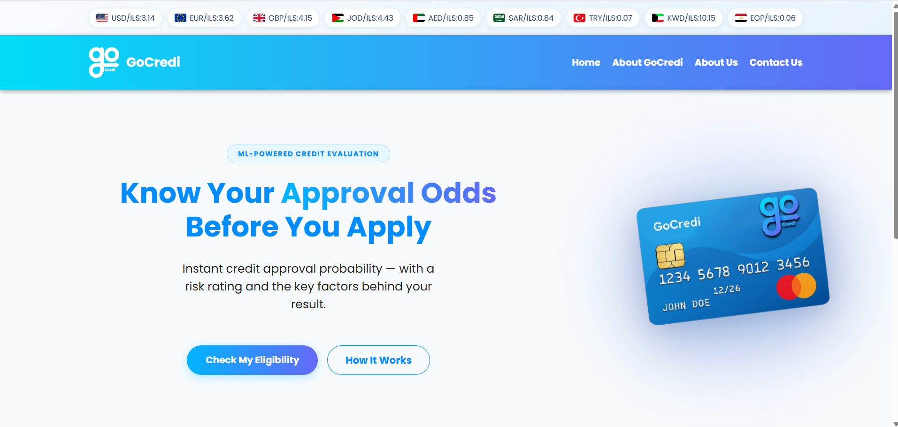
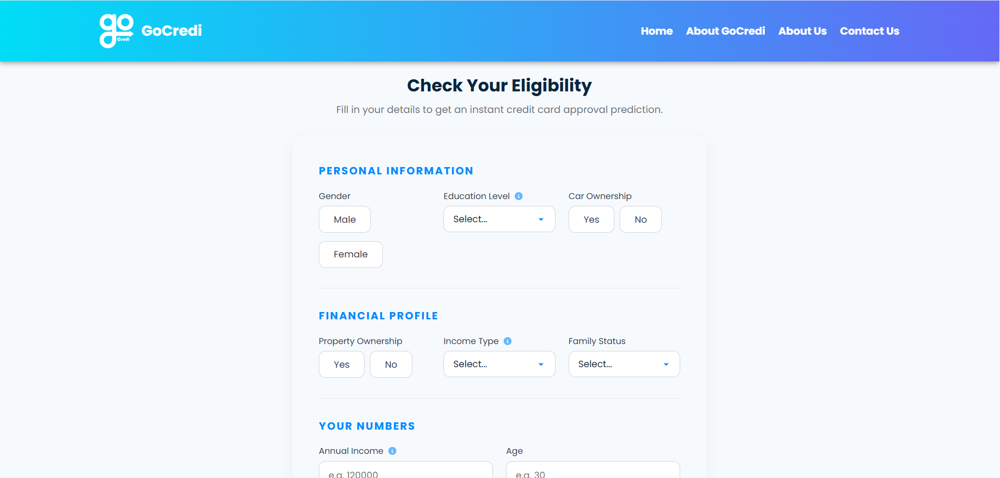
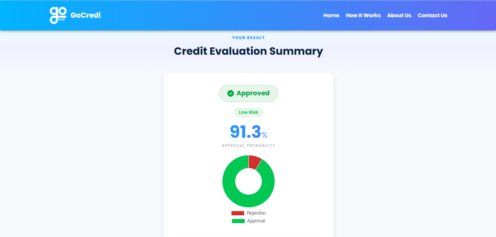

# GoCredi — Credit Card Approval Prediction

A production-style Flask + machine learning application that predicts credit card approval likelihood from a user's financial profile. Built on a trained Random Forest pipeline with SMOTE-based class balancing, the system returns an approval probability, a risk tier, and the top model factors behind the result — all through a clean web UI and a JSON REST API.

## Key Features

- **Approval prediction** — Random Forest classifier returning Approved / Not Approved
- **Probability breakdown** — acceptance and rejection percentages with a doughnut chart
- **Risk tier** — Low, Medium, or High based on approval probability thresholds
- **Explainability** — top 3 globally most influential model features displayed per result
- **Server-side validation** — all 10 input fields validated before prediction
- **JSON API** — `POST /api/predict` for programmatic access
- **Structured logging** — every prediction logged with key fields for traceability
- **Health endpoint** — `GET /health` for uptime monitoring

---

## System Architecture

```
Browser / API Client
       │
       ▼
  Flask (routes.py)
       │
  validate_form()          ← app/validators.py
       │
  predict_credit()         ← app/services/prediction_service.py
       │
  ImbPipeline.predict()    ← model_artifacts/pipeline.pkl
       │
  result.html / JSON
```

The ML pipeline is loaded once at startup into `app.config["PIPELINE"]` and shared across all requests. No pipeline reload per request.

---

## ML Approach

| Component       | Detail                                                        |
| --------------- | ------------------------------------------------------------- |
| Algorithm       | Random Forest (100 estimators)                                |
| Preprocessing   | StandardScaler (numerical) + OneHotEncoder (categorical)      |
| Class balancing | SMOTE — applied inside ImbPipeline during training only       |
| Feature set     | Set B — 10 features (see below)                               |
| Tuning          | RandomizedSearchCV (n_iter=10) with 5-fold StratifiedKFold CV |

### Input Features (Set B)

| Field              | Type        | Example                            |
| ------------------ | ----------- | ---------------------------------- |
| Gender             | Categorical | `M` / `F`                          |
| Car ownership      | Categorical | `Y` / `N`                          |
| Property ownership | Categorical | `Y` / `N`                          |
| Education level    | Categorical | `Higher education`                 |
| Income type        | Categorical | `Working`, `Pensioner`, `Student`… |
| Family status      | Categorical | `Married`, `Single / not married`… |
| Annual income      | Numeric     | `150000`                           |
| Age                | Numeric     | `35`                               |
| Years employed     | Numeric     | `8`                                |
| Family members     | Numeric     | `3`                                |

### Explainability Note

The top 3 features shown on the result page reflect **global model feature importances** (Random Forest's `feature_importances_`), aggregated back from OHE dummy columns to original feature names. They represent which features matter most to the model overall — not a per-prediction SHAP explanation.

---

## API

### Health Check

```
GET /health
```

```json
{ "status": "ok" }
```

### Predict

```
POST /api/predict
Content-Type: application/json
```

**Request:**

```json
{
  "gender": "M",
  "own_car": "Y",
  "own_realty": "N",
  "education": "Higher education",
  "income_type": "Working",
  "family_status": "Married",
  "income": "150000",
  "age": "35",
  "years_employed": "8",
  "family_members": "3"
}
```

**Response:**

```json
{
  "prediction": 1,
  "risk_level": "Low",
  "acceptance": 84.2,
  "rejection": 15.8,
  "top_features": ["Annual Income", "Years Employed", "Age"]
}
```

| Field                      | Values                                               |
| -------------------------- | ---------------------------------------------------- |
| `prediction`               | `1` = Approved, `0` = Not Approved                   |
| `risk_level`               | `"Low"` (≥70%), `"Medium"` (40–69%), `"High"` (<40%) |
| `acceptance` / `rejection` | Probabilities summing to 100                         |
| `top_features`             | Up to 3 global feature importance labels             |

Validation errors return HTTP 400:

```json
{
  "error": "Validation failed",
  "details": "Age must be between 18 and 100."
}
```

---

## Setup

### Requirements

- **Python 3.11** (recommended — `pipeline.pkl` was serialized with scikit-learn 1.6.1 on Python 3.11)
- If Python 3.11 is unavailable, retrain the model using the notebook and update `requirements.txt` with `pip freeze`

### Installation

```bash
# 1. Create a virtual environment (Python 3.11)
py -3.11 -m venv credit_card_app/venv

# 2. Activate it
# Windows:
credit_card_app\venv\Scripts\activate
# macOS / Linux:
source credit_card_app/venv/bin/activate

# 3. Install dependencies
pip install -r credit_card_app/requirements.txt

# 4. Run the app
python credit_card_app/run.py
```

The app will be available at `http://127.0.0.1:5000`.

---

## Deployment (Render)

**Build command:**

```
pip install -r credit_card_app/requirements.txt
```

**Start command:**

```
gunicorn --chdir credit_card_app "app:create_app()"
```

**Required environment variables:**

| Variable         | Value                      |
| ---------------- | -------------------------- |
| `SECRET_KEY`     | A strong random secret key |
| `PYTHON_VERSION` | `3.11.9`                   |

> **Note:** `pipeline.pkl` was serialized with scikit-learn 1.6.1 on Python 3.11. Setting `PYTHON_VERSION=3.11.9` on Render is required — loading the pipeline on any other Python version will raise a `_RemainderColsList` error and crash the app on startup.

Generate a secure `SECRET_KEY` with:

```bash
python -c "import secrets; print(secrets.token_hex(32))"
```

---

## Project Structure

```
GoCreadi/
├── credit_card_app/
│   ├── run.py                        # Entry point
│   ├── config.py                     # App config (SECRET_KEY)
│   ├── requirements.txt              # Pinned dependencies
│   └── app/
│       ├── __init__.py               # App factory, pipeline loading, logging
│       ├── routes.py                 # All routes (web UI + API)
│       ├── validators.py             # Server-side input validation
│       ├── services/
│       │   └── prediction_service.py # predict_credit(), feature importance
│       ├── static/
│       │   ├── css/
│       │   │   ├── style.css         # Entry point — imports all modules below
│       │   │   ├── base.css          # Variables, reset, typography
│       │   │   ├── navbar.css
│       │   │   ├── hero.css
│       │   │   ├── ticker.css
│       │   │   ├── cards.css
│       │   │   ├── form.css
│       │   │   ├── result.css
│       │   │   ├── pages.css         # Shared inner-page layouts
│       │   │   ├── modal.css
│       │   │   └── responsive.css
│       │   ├── js/
│       │   │   ├── main.js
│       │   │   └── currency.js
│       │   └── img/
│       └── templates/
│           ├── base.html             # Shared layout (extends all inner pages)
│           ├── index.html            # Landing page
│           ├── form.html             # Input form
│           ├── result.html           # Prediction result
│           ├── about.html
│           ├── aboutus.html
│           ├── contact.html
│           ├── error.html
│           └── partials/             # navbar, footer, ticker, modals
├── model_artifacts/
│   └── pipeline.pkl                  # Trained pipeline (6.4 MB)
├── notebooks/
│   └── credit_approval_model.ipynb   # Full training notebook
└── data/                             # Not committed (~67 MB)
    ├── application_record.csv
    └── credit_record.csv
```

---

## Data

Raw data files are not committed to this repository.

| File                     | Rows      | Source |
| ------------------------ | --------- | ------ |
| `application_record.csv` | 438,557   | Kaggle |
| `credit_record.csv`      | 1,048,575 | Kaggle |

Place both files in the `data/` directory before running the training notebook.

---

## Screenshots





---

## Future Improvements

- **Per-prediction explainability** — replace global feature importance with SHAP values
- **Unit and integration tests** — currently no test coverage
- **Deployment** — host on Render or Railway for a live demo URL
- **Contact form** — functional via EmailJS; direct email delivery with no backend dependency

---

## Usage Notice

This project is shared for portfolio and demonstration purposes only.
Commercial use, redistribution, or reuse of substantial parts of the code
requires prior written permission from the author.

---

## Project Note

This repository contains a substantially reworked and extended version of an earlier university programming project. The current implementation and major improvements — including ML pipeline cleanup, Set B feature migration, server-side validation, risk classification, explainability, structured logging, and API support — were completed by **Othman Muhammad Al-Obayyat**.

---

_Palestine Ahliya University — programming Project, 2025_

---

## License

This project is proprietary and is provided for portfolio purposes only.

Unauthorized use, copying, or distribution of this code is not allowed.
See the LICENSE file for details.
